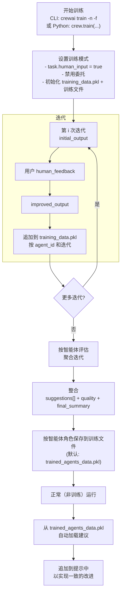

# 训练

> 了解如何通过早期反馈来训练您的 CrewAI 智能体，并获得一致的结果。

## 概述

CrewAI 中的训练功能允许您使用命令行界面（CLI）来训练您的 AI 智能体。
通过运行命令 `crewai train -n <n_iterations>`，您可以指定训练过程的迭代次数。

在训练期间，CrewAI 利用各种技术来优化您的智能体性能并结合人类反馈。
这有助于智能体提高理解能力、决策能力和解决问题的能力。

### 使用 CLI 训练您的团队

要使用训练功能，请按照以下步骤操作：

1. 打开您的终端或命令提示符。
2. 导航到您的 CrewAI 项目所在的目录。
3. 运行以下命令：

```shell  theme={null}
crewai train -n <n_iterations> -f <filename.pkl>
```

<Tip>
  将 `<n_iterations>` 替换为所需的训练迭代次数，将 `<filename>` 替换为以 `.pkl` 结尾的适当文件名。
</Tip>

<Note>
  如果省略 `-f`，输出将默认为当前工作目录中的 `trained_agents_data.pkl`。您可以传递绝对路径来控制文件的写入位置。
</Note>

### 以编程方式训练您的团队

要以编程方式训练您的团队，请使用以下步骤：

1. 定义训练的迭代次数。
2. 指定训练过程的输入参数。
3. 在 try-except 块中执行训练命令，以处理潜在的错误。

```python Code theme={null}
n_iterations = 2
inputs = {"topic": "CrewAI Training"}
filename = "your_model.pkl"

try:
    YourCrewName_Crew().crew().train(
      n_iterations=n_iterations,
      inputs=inputs,
      filename=filename
    )

except Exception as e:
    raise Exception(f"训练团队时发生错误: {e}")
```

## 训练数据如何被智能体使用

CrewAI 以两种方式使用训练工件：在训练期间结合您的人类反馈，以及在训练后通过整合的建议来指导智能体。

### 训练数据流



### 在训练运行期间

* 在每次迭代中，系统为每个智能体记录：
  * `initial_output`：智能体的第一个答案
  * `human_feedback`：提示时您的内联反馈
  * `improved_output`：智能体在反馈后的后续答案
* 这些数据存储在一个名为 `training_data.pkl` 的工作文件中，按智能体的内部 ID 和迭代进行键控。
* 在训练激活期间，智能体会自动将您之前的人类反馈追加到其提示中，以在训练会话内的后续尝试中强制执行这些指令。
  训练是交互式的：任务设置 `human_input = true`，因此在非交互环境中运行将会阻塞在用户输入上。

### 训练完成后

* 当 `train(...)` 完成时，CrewAI 会按智能体评估收集的训练数据，并生成一个包含以下内容的整合结果：
  * `suggestions`：从您的反馈以及初始/改进输出之间的差异中提炼出的清晰、可操作的指令
  * `quality`：一个 0-10 的分数，捕捉改进程度
  * `final_summary`：为未来任务提供的一步一步的行动项列表
* 这些整合结果保存到您传递给 `train(...)` 的文件名中（通过 CLI 默认为 `trained_agents_data.pkl`）。条目按智能体的 `role` 键控，以便可以在会话间应用。
* 在正常（非训练）执行期间，每个智能体自动加载其整合的 `suggestions`，并将它们作为强制指令附加到任务提示中。这为您提供了一致的改进，而无需更改您的智能体定义。

### 文件总结

* `training_data.pkl`（临时的，每会话）：
  * 结构：`agent_id -> { iteration_number: { initial_output, human_feedback, improved_output } }`
  * 目的：在训练期间捕获原始数据和人类反馈
  * 位置：保存在当前工作目录（CWD）中
* `trained_agents_data.pkl`（或您的自定义文件名）：
  * 结构：`agent_role -> { suggestions: string[], quality: number, final_summary: string }`
  * 目的：为将来的运行持久化整合的指导
  * 位置：默认写入 CWD；使用 `-f` 设置自定义（包括绝对）路径

## 小语言模型注意事项

<Warning>
  当使用较小的语言模型（≤7B 参数）进行训练数据评估时，请注意它们可能在生成结构化输出和遵循复杂指令方面面临挑战。
</Warning>

### 训练评估中小模型的局限性

<CardGroup cols={2}>
  <Card title="JSON 输出准确性" icon="triangle-exclamation">
    较小的模型通常难以生成结构化训练评估所需的有效 JSON 响应，导致解析错误和数据不完整。
  </Card>

  <Card title="评估质量" icon="chart-line">
    与较大的模型相比，参数少于 7B 的模型可能提供较细微的评估，推理深度有限。
  </Card>

  <Card title="指令遵循" icon="list-check">
    较小的模型可能无法完全遵循或考虑复杂的训练评估标准。
  </Card>

  <Card title="一致性" icon="rotate">
    使用较小模型时，多次训练迭代的评估可能缺乏一致性。
  </Card>
</CardGroup>

### 训练建议

<Tabs>
  <Tab title="最佳实践">
    为了获得最佳训练质量和可靠的评估，我们强烈建议使用至少 7B 参数或更大的模型：

    ```python  theme={null}
    from crewai import Agent, Crew, Task, LLM

    # 训练评估的推荐最小值
    llm = LLM(model="mistral/open-mistral-7b")

    # 可靠训练评估的更好选择
    llm = LLM(model="anthropic/claude-3-sonnet-20240229-v1:0")
    llm = LLM(model="gpt-4o")

    # 将此 LLM 与您的智能体一起使用
    agent = Agent(
        role="Training Evaluator",
        goal="提供准确的训练反馈",
        llm=llm
    )
    ```

    <Tip>
      更强大的模型提供更高质量的反馈和更好的推理能力，从而带来更有效的训练迭代。
    </Tip>
  </Tab>
  <Tab title="小模型使用">
    如果您必须使用较小的模型进行训练评估，请注意这些限制：

    ```python  theme={null}
    # 使用较小的模型（预期会有一些限制）
    llm = LLM(model="huggingface/microsoft/Phi-3-mini-4k-instruct")
    ```

    <Warning>
      虽然 CrewAI 包含对小模型的优化，但预期评估结果会不那么可靠和细致，可能需要训练期间更多的人类干预。
    </Warning>
  </Tab>
</Tabs>

### 需注意的关键点

* **正整数要求：** 确保迭代次数（`n_iterations`）是一个正整数。如果不满足此条件，代码将引发 `ValueError`。
* **文件名要求：** 确保文件名以 `.pkl` 结尾。如果不满足此条件，代码将引发 `ValueError`。
* **错误处理：** 代码处理子流程错误和意外异常，向用户提供错误消息。
* 训练的指导在提示时应用；它不会修改您的 Python/YAML 智能体配置。
* 智能体自动从位于当前工作目录中的名为 `trained_agents_data.pkl` 的文件加载训练的建议。如果您训练到不同的文件名，请在运行之前将其重命名为 `trained_agents_data.pkl`，或者在代码中调整加载器。
* 您可以使用 `-f/--filename` 调用 `crewai train` 时更改输出文件名。如果要在 CWD 外保存，支持绝对路径。

需要注意的是，训练过程可能需要一些时间，这取决于您的智能体的复杂性，并且还需要您在每次迭代时提供反馈。

一旦训练完成，您的智能体将具备增强的能力和知识，准备好处理复杂的任务并提供更一致和有价值的见解。

记得定期更新和重新训练您的智能体，以确保它们保持与该领域的最新信息和进展同步。